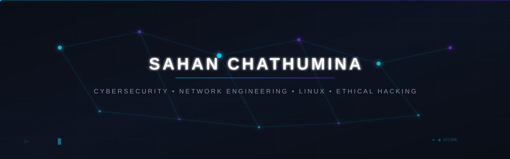
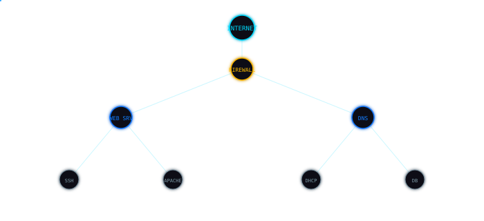

<div align="center">



</div>

<div align="center">

```
┌─────────────────────────────────────────────────────┐
│  $ whoami                                            │
│  sahan.chathumina@cyberlab                        │
│                                                      │
│  $ focus                                             │
│  Cybersecurity                                       │
│  Network Engineering                                 │
│  Linux                                               │
│  Ethical Hacking                                     │
│                                                      │
│  $ status                                            │
│  ● ONLINE  •  LEARNING  •  BUILDING                  │
└─────────────────────────────────────────────────────┘
```

</div>

<div align="center">

## About Me

<svg xmlns="http://www.w3.org/2000/svg" viewBox="0 0 800 340" width="800" height="340">
  <defs>
    <linearGradient id="ab-card" x1="0%" y1="0%" x2="100%" y2="100%">
      <stop offset="0%" style="stop-color:#0B1117;stop-opacity:0.95"/>
      <stop offset="100%" style="stop-color:#111820;stop-opacity:0.9"/>
    </linearGradient>
    <linearGradient id="ab-border" x1="0%" y1="0%" x2="100%" y2="100%">
      <stop offset="0%" style="stop-color:#00D9FF;stop-opacity:0.4"/>
      <stop offset="50%" style="stop-color:#1479FF;stop-opacity:0.2"/>
      <stop offset="100%" style="stop-color:#00D9FF;stop-opacity:0.1"/>
    </linearGradient>
    <linearGradient id="ab-accent" x1="0%" y1="0%" x2="100%" y2="0%">
      <stop offset="0%" style="stop-color:#00D9FF;stop-opacity:1"/>
      <stop offset="100%" style="stop-color:#1479FF;stop-opacity:1"/>
    </linearGradient>
    <filter id="ab-glow">
      <feGaussianBlur stdDeviation="4" result="b"/>
      <feMerge><feMergeNode in="b"/><feMergeNode in="SourceGraphic"/></feMerge>
    </filter>
    <filter id="ab-soft">
      <feGaussianBlur stdDeviation="1.5"/>
    </filter>
    <clipPath id="ab-clip">
      <rect x="40" y="40" width="720" height="260" rx="16"/>
    </clipPath>
  </defs>

  <!-- Background glow -->
  <ellipse cx="400" cy="170" rx="300" ry="150" fill="#00D9FF" opacity="0.03" filter="url(#ab-soft)"/>

  <!-- Card background -->
  <rect x="40" y="40" width="720" height="260" rx="16" fill="url(#ab-card)"/>
  <rect x="40" y="40" width="720" height="260" rx="16" fill="none" stroke="url(#ab-border)" stroke-width="1"/>

  <!-- Top accent line -->
  <rect x="60" y="40" width="80" height="2" rx="1" fill="url(#ab-accent)" opacity="0.8"/>

  <!-- Section label -->
  <text x="64" y="72" font-family="'SF Mono','Cascadia Code','Consolas',monospace" font-size="10" fill="#00D9FF" letter-spacing="2" opacity="0.7">PROFILE</text>

  <!-- Vertical accent bar -->
  <rect x="64" y="90" width="2" height="50" rx="1" fill="url(#ab-accent)" opacity="0.6"/>

  <!-- Name -->
  <text x="80" y="108" font-family="'Segoe UI','Inter',Arial,sans-serif" font-size="22" font-weight="700" fill="#EAF7FF">Sahan Chathumina</text>

  <!-- Tagline -->
  <text x="80" y="130" font-family="'SF Mono','Cascadia Code','Consolas',monospace" font-size="12" fill="#00D9FF" letter-spacing="0.5">Cybersecurity | Network Engineering | Linux | Ethical Hacking</text>

  <!-- Animated cursor -->
  <rect x="519.2" y="119" width="8" height="14" fill="#00D9FF" opacity="0.7">
    <animate attributeName="opacity" values="0.7;0;0.7" dur="1.2s" repeatCount="indefinite"/>
  </rect>

  <!-- Divider line -->
  <line x1="64" y1="150" x2="736" y2="150" stroke="#1A2736" stroke-width="0.5" opacity="0.5"/>

  <!-- Description text -->
  <foreignObject x="64" y="160" width="672" height="80">
    <div xmlns="http://www.w3.org/1999/xhtml" style="font-family:'Segoe UI',Arial,sans-serif;font-size:13px;line-height:1.6;color:#7F95A5;">
      Building secure systems. Exploring networks. Learning cybersecurity through hands-on projects.
    </div>
  </foreignObject>

  <!-- Focus areas -->
  
  <rect x="64" y="250" width="165" height="36" rx="8" fill="#111820" stroke="#1A2736" stroke-width="0.5" opacity="0.8"/>
  <circle cx="78" cy="268" r="3" fill="#00D9FF" opacity="0.8">
    <animate attributeName="opacity" values="0.5;1;0.5" dur="2s" repeatCount="indefinite"/>
  </circle>
  <text x="88" y="272" font-family="'SF Mono','Cascadia Code','Consolas',monospace" font-size="11" fill="#EAF7FF">Cybersecurity</text>

  <rect x="244" y="250" width="165" height="36" rx="8" fill="#111820" stroke="#1A2736" stroke-width="0.5" opacity="0.8"/>
  <circle cx="258" cy="268" r="3" fill="#00D9FF" opacity="0.8">
    <animate attributeName="opacity" values="0.5;1;0.5" dur="2.5s" repeatCount="indefinite"/>
  </circle>
  <text x="268" y="272" font-family="'SF Mono','Cascadia Code','Consolas',monospace" font-size="11" fill="#EAF7FF">Network Engineering</text>

  <rect x="424" y="250" width="165" height="36" rx="8" fill="#111820" stroke="#1A2736" stroke-width="0.5" opacity="0.8"/>
  <circle cx="438" cy="268" r="3" fill="#00D9FF" opacity="0.8">
    <animate attributeName="opacity" values="0.5;1;0.5" dur="3s" repeatCount="indefinite"/>
  </circle>
  <text x="448" y="272" font-family="'SF Mono','Cascadia Code','Consolas',monospace" font-size="11" fill="#EAF7FF">Linux</text>

  <rect x="604" y="250" width="165" height="36" rx="8" fill="#111820" stroke="#1A2736" stroke-width="0.5" opacity="0.8"/>
  <circle cx="618" cy="268" r="3" fill="#00D9FF" opacity="0.8">
    <animate attributeName="opacity" values="0.5;1;0.5" dur="3.5s" repeatCount="indefinite"/>
  </circle>
  <text x="628" y="272" font-family="'SF Mono','Cascadia Code','Consolas',monospace" font-size="11" fill="#EAF7FF">Ethical Hacking</text>

  <!-- Stats row -->
  <line x1="64" y1="300" x2="736" y2="300" stroke="#1A2736" stroke-width="0.5" opacity="0.3"/>

  
  <text x="64" y="322" font-family="'SF Mono','Cascadia Code','Consolas',monospace" font-size="10" fill="#7F95A5" letter-spacing="1">FOCUS</text>
  <text x="64" y="344" font-family="'Segoe UI','Inter',Arial,sans-serif" font-size="16" font-weight="700" fill="#EAF7FF">Security &amp; Networks</text>

  <text x="288" y="322" font-family="'SF Mono','Cascadia Code','Consolas',monospace" font-size="10" fill="#7F95A5" letter-spacing="1">STATUS</text>
  <text x="288" y="344" font-family="'Segoe UI','Inter',Arial,sans-serif" font-size="16" font-weight="700" fill="#EAF7FF">Learning &amp; Building</text>

  <text x="512" y="322" font-family="'SF Mono','Cascadia Code','Consolas',monospace" font-size="10" fill="#7F95A5" letter-spacing="1">STACK</text>
  <text x="512" y="344" font-family="'Segoe UI','Inter',Arial,sans-serif" font-size="16" font-weight="700" fill="#EAF7FF">Linux • Python • Bash</text>

  <!-- Bottom accent -->
  <rect x="660" y="298" width="80" height="2" rx="1" fill="url(#ab-accent)" opacity="0.4"/>

  <!-- Corner decorations -->
  <path d="M 56 44 L 52 44 L 44 52 L 44 56" fill="none" stroke="#00D9FF" stroke-width="0.5" opacity="0.3"/>
  <path d="M 744 296 L 748 296 L 756 288 L 756 284" fill="none" stroke="#00D9FF" stroke-width="0.5" opacity="0.3"/>
</svg>

</div>

<div align="center">

## Skill Overview



</div>

## Skills & Technologies

### Cybersecurity

       

### Networking

         

### Linux & Systems

           

### Development

     

### Tools

      


<div align="center"><svg xmlns="http://www.w3.org/2000/svg" viewBox="0 0 800 20" width="800" height="20">
  <defs>
    <linearGradient id="sd-g" x1="0%" y1="0%" x2="100%" y2="0%">
      <stop offset="0%" style="stop-color:#00D9FF;stop-opacity:0"/>
      <stop offset="45%" style="stop-color:#00D9FF;stop-opacity:0.4"/>
      <stop offset="50%" style="stop-color:#1479FF;stop-opacity:0.6"/>
      <stop offset="55%" style="stop-color:#00D9FF;stop-opacity:0.4"/>
      <stop offset="100%" style="stop-color:#00D9FF;stop-opacity:0"/>
    </linearGradient>
  </defs>
  <line x1="0" y1="10" x2="800" y2="10" stroke="url(#sd-g)" stroke-width="1"/>
  <circle cx="400" cy="10" r="2.5" fill="#00D9FF" opacity="0.5"/>
</svg></div>


<div align="center">

## Network Architecture



</div>

## Featured Projects

<table>
<tr>
<td width="33%" valign="top">

> **PROJECT 01**

### Network Security Lab

Hands-on environment for practicing network security, Linux administration, DNS, DHCP, and server hardening.

<sub>Linux • Networking • DNS • DHCP • Bash</sub>


</td>
<td width="33%" valign="top">

> **PROJECT 02**

### Linux Server Hardening

Server hardening lab covering SSH security, firewall rules, SELinux, audit logging, and system monitoring.

<sub>Linux • SSH • firewalld • SELinux • Auditd</sub>


</td>
<td width="33%" valign="top">

> **PROJECT 03**

### DNS & DHCP Lab

Configured BIND DNS and ISC DHCP servers on CentOS with zone transfers and dynamic updates.

<sub>Linux • BIND • DHCP • CentOS • Networking</sub>


</td>
</tr>
<tr>
<td width="33%" valign="top">

> **PROJECT 04**

### Python Security Scripts

Collection of Python scripts for network scanning, port detection, and security automation tasks.

<sub>Python • Networking • Security</sub>


</td>
<td width="33%" valign="top">

> **PROJECT 05**

### Firewall Configuration Lab

Practicing firewall rules with firewalld, iptables, and network segmentation scenarios.

<sub>Linux • firewalld • Networking • Security</sub>


</td>
<td width="33%" valign="top">

> **PROJECT 06**

### Web Application Security Lab

Hands-on practice with common web vulnerabilities in a controlled lab environment.

<sub>Web Security • HTTP • Burp Suite</sub>


</td>
</tr>
</table>


<div align="center"><svg xmlns="http://www.w3.org/2000/svg" viewBox="0 0 800 20" width="800" height="20">
  <defs>
    <linearGradient id="sd-g" x1="0%" y1="0%" x2="100%" y2="0%">
      <stop offset="0%" style="stop-color:#00D9FF;stop-opacity:0"/>
      <stop offset="45%" style="stop-color:#00D9FF;stop-opacity:0.4"/>
      <stop offset="50%" style="stop-color:#1479FF;stop-opacity:0.6"/>
      <stop offset="55%" style="stop-color:#00D9FF;stop-opacity:0.4"/>
      <stop offset="100%" style="stop-color:#00D9FF;stop-opacity:0"/>
    </linearGradient>
  </defs>
  <line x1="0" y1="10" x2="800" y2="10" stroke="url(#sd-g)" stroke-width="1"/>
  <circle cx="400" cy="10" r="2.5" fill="#00D9FF" opacity="0.5"/>
</svg></div>


## Cybersecurity Lab

| Platform | Category | Challenge | Difficulty | Skills |
|----------|----------|-----------|------------|--------|
| TryHackMe | Web Exploitation | Various web security challenges | Easy - Medium | SQL Injection, XSS, Web Enumeration |
| TryHackMe | Forensics | File analysis and memory forensics | Easy | File Analysis, Memory Forensics, Log Analysis |
| PicoCTF | Cryptography | Basic cryptography challenges | Easy - Medium | Encoding, Basic Crypto, Problem Solving |


## Linux Labs

| Lab | Technology | Objective | Status |
|-----|-----------|-----------|--------|
| SSH Security Lab | Linux, SSH | Configure SSH key-based auth, disable root login, implement fail2ban |  |
| DNS Server Lab | Linux, BIND, DNS | Set up BIND DNS master/slave with zone transfers |  |
| DHCP Server Lab | Linux, DHCP | Configure ISC DHCP with reservations and relay agents |  |
| Firewall Rules Lab | Linux, firewalld, Networking | Implement zone-based firewall rules and NAT |  |
| Apache Web Server Lab | Linux, Apache | Configure virtual hosts, SSL/TLS, and access controls |  |
| SELinux Lab | Linux, SELinux | Configure SELinux policies and troubleshoot denials |  |


## Networking Labs

| Lab | Technology | Objective | Status |
|-----|-----------|-----------|--------|
| DNS Server Lab | Linux, BIND, DNS | Set up BIND DNS master/slave with zone transfers |  |
| DHCP Server Lab | Linux, DHCP | Configure ISC DHCP with reservations and relay agents |  |
| Firewall Rules Lab | Linux, firewalld, Networking | Implement zone-based firewall rules and NAT |  |
| Subnetting Practice | Networking, Subnetting | Practice VLSM subnetting and IP address planning |  |
| VLAN Configuration Lab | Networking, VLAN, Switching | Configure VLANs, trunk ports, and inter-VLAN routing |  |


<div align="center"><svg xmlns="http://www.w3.org/2000/svg" viewBox="0 0 800 20" width="800" height="20">
  <defs>
    <linearGradient id="sd-g" x1="0%" y1="0%" x2="100%" y2="0%">
      <stop offset="0%" style="stop-color:#00D9FF;stop-opacity:0"/>
      <stop offset="45%" style="stop-color:#00D9FF;stop-opacity:0.4"/>
      <stop offset="50%" style="stop-color:#1479FF;stop-opacity:0.6"/>
      <stop offset="55%" style="stop-color:#00D9FF;stop-opacity:0.4"/>
      <stop offset="100%" style="stop-color:#00D9FF;stop-opacity:0"/>
    </linearGradient>
  </defs>
  <line x1="0" y1="10" x2="800" y2="10" stroke="url(#sd-g)" stroke-width="1"/>
  <circle cx="400" cy="10" r="2.5" fill="#00D9FF" opacity="0.5"/>
</svg></div>


<div align="center">

## Certifications & Courses

<svg xmlns="http://www.w3.org/2000/svg" viewBox="0 0 600 170" width="600" height="170">
  <line x1="60" y1="20" x2="60" y2="100" stroke="#1A2736" stroke-width="1.5" opacity="0.4"/>
  
  <circle cx="60" cy="30" r="6" fill="#05070A" stroke="#00FF88" stroke-width="2"/>
  <circle cx="60" cy="30" r="2.5" fill="#00FF88">
    <animate attributeName="opacity" values="0.6;1;0.6" dur="2s" repeatCount="indefinite" begin="0s"/>
  </circle>
  <text x="80" y="22" font-family="'SF Mono','Cascadia Code','Consolas',monospace" font-size="13" font-weight="600" fill="#00FF88">2026</text>
  <text x="80" y="38" font-family="'Segoe UI','Inter',Arial,sans-serif" font-size="14" fill="#EAF7FF">Red Hat System Administration I</text>
  <text x="80" y="54" font-family="'Segoe UI','Inter',Arial,sans-serif" font-size="12" fill="#7F95A5">Red Hat</text>
  <circle cx="60" cy="100" r="6" fill="#05070A" stroke="#00D9FF" stroke-width="2"/>
  <circle cx="60" cy="100" r="2.5" fill="#00D9FF">
    <animate attributeName="opacity" values="0.6;1;0.6" dur="2s" repeatCount="indefinite" begin="0.3s"/>
  </circle>
  <text x="80" y="92" font-family="'SF Mono','Cascadia Code','Consolas',monospace" font-size="13" font-weight="600" fill="#00D9FF">2026</text>
  <text x="80" y="108" font-family="'Segoe UI','Inter',Arial,sans-serif" font-size="14" fill="#EAF7FF">CCNA: Introduction to Networks</text>
  <text x="80" y="124" font-family="'Segoe UI','Inter',Arial,sans-serif" font-size="12" fill="#7F95A5">Cisco</text>
</svg>

</div>

<div align="center">

## Education

<svg xmlns="http://www.w3.org/2000/svg" viewBox="0 0 600 170" width="600" height="170">
  <line x1="60" y1="20" x2="60" y2="100" stroke="#1A2736" stroke-width="1.5" opacity="0.4"/>
  
  <circle cx="60" cy="30" r="6" fill="#05070A" stroke="#00D9FF" stroke-width="2"/>
  <circle cx="60" cy="30" r="2.5" fill="#00D9FF">
    <animate attributeName="opacity" values="0.6;1;0.6" dur="2s" repeatCount="indefinite" begin="0s"/>
  </circle>
  <text x="80" y="22" font-family="'SF Mono','Cascadia Code','Consolas',monospace" font-size="13" font-weight="600" fill="#00D9FF">2024 - Present</text>
  <text x="80" y="38" font-family="'Segoe UI','Inter',Arial,sans-serif" font-size="14" fill="#EAF7FF">BSc (Hons) in Ethical Hacking &amp; Network Security</text>
  <text x="80" y="54" font-family="'Segoe UI','Inter',Arial,sans-serif" font-size="12" fill="#7F95A5">University</text>
  <circle cx="60" cy="100" r="6" fill="#05070A" stroke="#00D9FF" stroke-width="2"/>
  <circle cx="60" cy="100" r="2.5" fill="#00D9FF">
    <animate attributeName="opacity" values="0.6;1;0.6" dur="2s" repeatCount="indefinite" begin="0.3s"/>
  </circle>
  <text x="80" y="92" font-family="'SF Mono','Cascadia Code','Consolas',monospace" font-size="13" font-weight="600" fill="#00D9FF">2023 - Present</text>
  <text x="80" y="108" font-family="'Segoe UI','Inter',Arial,sans-serif" font-size="14" fill="#EAF7FF">Higher National Diploma in Network Engineering</text>
  <text x="80" y="124" font-family="'Segoe UI','Inter',Arial,sans-serif" font-size="12" fill="#7F95A5">Institute of Network Engineering</text>
</svg>

</div>

## Currently Learning

> ● **ACTIVE**

- Cybersecurity Fundamentals
- Network Security
- Linux System Administration
- Ethical Hacking
- CTF Challenges
- Python for Security Automation
- Cloud & Infrastructure Security


<div align="center"><svg xmlns="http://www.w3.org/2000/svg" viewBox="0 0 800 20" width="800" height="20">
  <defs>
    <linearGradient id="sd-g" x1="0%" y1="0%" x2="100%" y2="0%">
      <stop offset="0%" style="stop-color:#00D9FF;stop-opacity:0"/>
      <stop offset="45%" style="stop-color:#00D9FF;stop-opacity:0.4"/>
      <stop offset="50%" style="stop-color:#1479FF;stop-opacity:0.6"/>
      <stop offset="55%" style="stop-color:#00D9FF;stop-opacity:0.4"/>
      <stop offset="100%" style="stop-color:#00D9FF;stop-opacity:0"/>
    </linearGradient>
  </defs>
  <line x1="0" y1="10" x2="800" y2="10" stroke="url(#sd-g)" stroke-width="1"/>
  <circle cx="400" cy="10" r="2.5" fill="#00D9FF" opacity="0.5"/>
</svg></div>


## GitHub Statistics

<div align="center">


</div>


<div align="center">

## Connect With Me

[](https://github.com/Sahan-Chathumina-25)

</div>

<div align="center">


### <sub>SYSTEM STATUS: ONLINE</sub>

**BUILD  •  LEARN  •  SECURE**

</div>