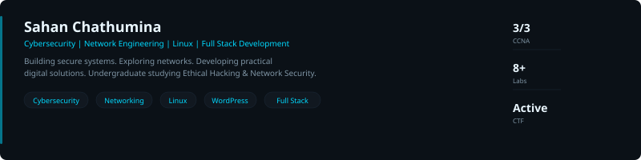
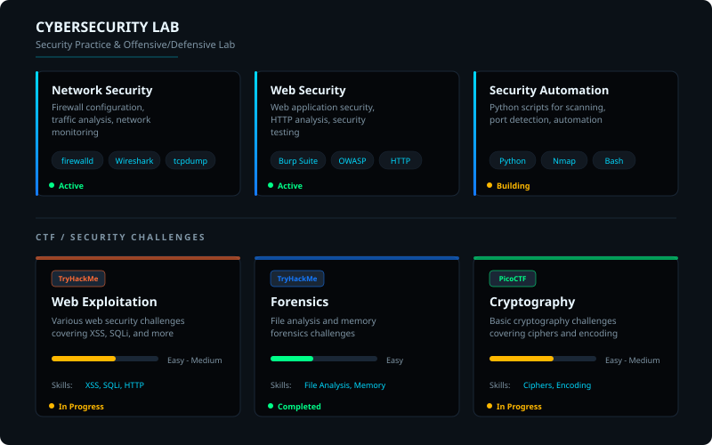
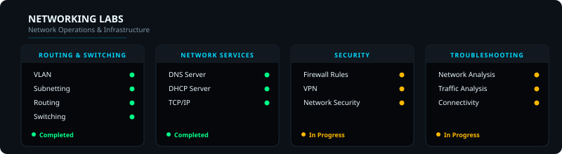
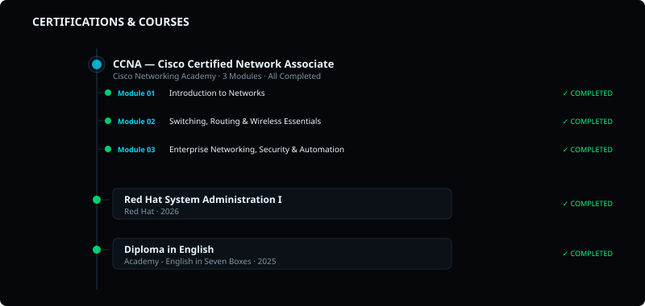

## About Me

I'm Sahan Chathumina, a cybersecurity and network engineering student focused on building practical experience across network security, Linux administration, system administration and web development.

My main technical interests include cybersecurity, network infrastructure, ethical hacking, Linux server administration, network troubleshooting and secure system configuration.

I enjoy building and testing practical lab environments rather than learning only through theory. My work includes networking, DNS, DHCP, firewalls, SSH, Apache, Linux hardening, security testing and network analysis.

Alongside infrastructure and security, I'm developing my Full Stack Development skills, with WordPress as my main focus, supported by technologies such as HTML, CSS, JavaScript, PHP and MySQL.

I'm continuously learning, experimenting with new technologies and turning what I learn into practical projects and labs. My long-term goal is to build strong expertise across cybersecurity, networking, systems and modern web development.

`BUILD` · `LEARN` · `SECURE`

## Who Am I

## Skill Overview

## Skills & Technologies

### Cybersecurity

       

### Networking

         

### Linux & Systems

           

### Full Stack Development

      

### Tools

      

## Network Architecture

## Featured Projects

<table>
<tr>
<td width="33%" valign="top">

> **PROJECT 01**

### Network Security Lab

Hands-on environment for practicing network security, Linux administration, DNS, DHCP, and server hardening.

Linux · Networking · DNS · DHCP · Bash

</td>
<td width="33%" valign="top">

> **PROJECT 02**

### Linux Server Hardening

Server hardening lab covering SSH security, firewall rules, SELinux, audit logging, and system monitoring.

Linux · SSH · firewalld · SELinux · Auditd

</td>
<td width="33%" valign="top">

> **PROJECT 03**

### DNS & DHCP Lab

Configured BIND DNS and ISC DHCP servers on CentOS with zone transfers and dynamic updates.

Linux · BIND · DHCP · CentOS · Networking

</td>
</tr>
<tr>
<td width="33%" valign="top">

> **PROJECT 04**

### Python Security Scripts

Collection of Python scripts for network scanning, port detection, and security automation tasks.

Python · Networking · Security

</td>
<td width="33%" valign="top">

> **PROJECT 05**

### Firewall Configuration Lab

Practicing firewall rules with firewalld, iptables, and network segmentation scenarios.

Linux · firewalld · Networking · Security

</td>
<td width="33%" valign="top">

> **PROJECT 06**

### Web Application Security Lab

Hands-on practice with common web vulnerabilities in a controlled lab environment.

Web Security · HTTP · Burp Suite

</td>
</tr>
</table>

## Cybersecurity Lab

## Linux Labs

## Networking Labs

## Certifications & Courses

## Education

- **BSc (Hons) in Ethical Hacking & Network Security** — University  (2024 - Present)
- **Higher National Diploma in Network Engineering** — Institute of Network Engineering  (2023 - Present)
- **Diploma in English** — Academy - English in Seven Boxes  (2025)

## Currently Learning

> ● **ACTIVE**

- Cybersecurity Fundamentals
- Network Security
- Linux System Administration
- Ethical Hacking
- CTF Challenges
- Python for Security Automation
- Cloud & Infrastructure Security

## GitHub Statistics

## Connect With Me

## Footer

